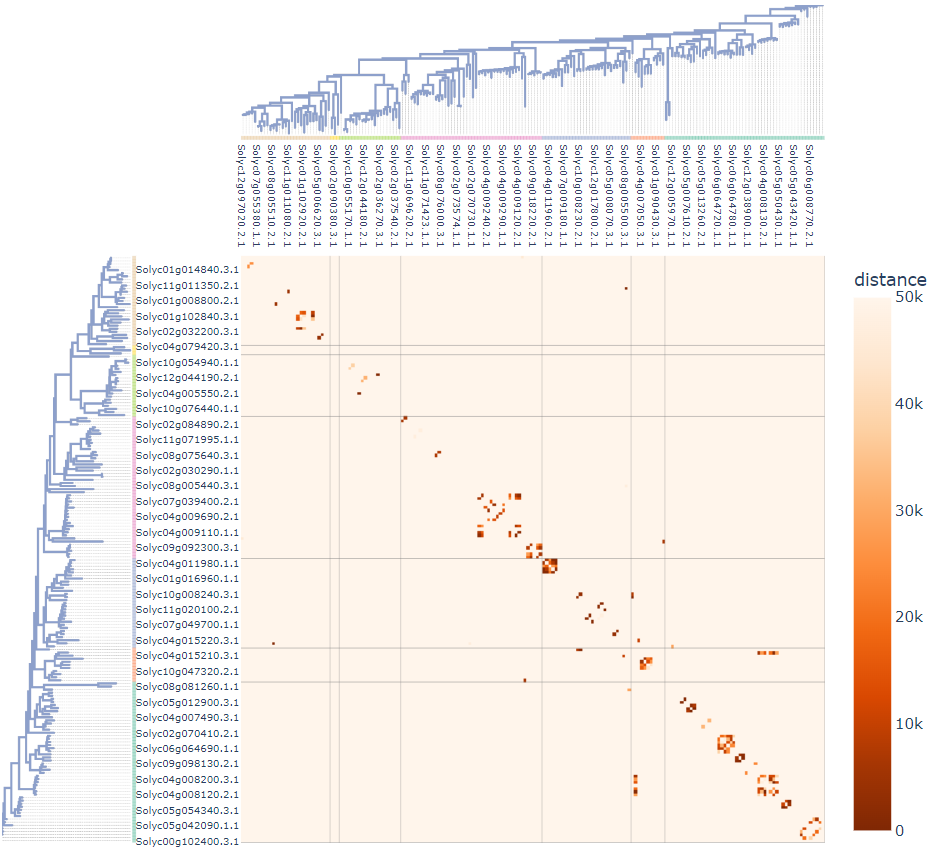

# Gene Cluster Matrix



## Description
**Gene cluter matrix** is a command line tool to generate matrix that visualize distances between genes and gene clusters. The matrix is generated as interactive html file. This tool can also visualize phylogenetic tree and phylogenetically related & unrelated gene clusters.

Gene cluster matrix is developed by Python program and distributed under the MIT license.

## Dependencies
gene_cluster_matrix requires:
* python (>= 3.6)
* numpy (>= 1.20.0)
* pandas (>= 1.2.0)
* plotly (>= 5.3.0)
* gffutils (>= 0.11.0)
* toytree (>= 2.0.1)
* toyplot (>= 1.0.1)
* Pillow (>= 9.2.0)

`ghostscript` is required to generate phylogenetic tree image.

c.f.) Linux:`sudo apt-get install ghostscript`, Mac:`brew install ghostscript`

## Install

`pip install gene_cluster_matrix`

## Usage

* simple distance matrix

`gene_cluster_matrix -g sample.gff3 -i id_list.txt -o output_name`

* distance matrix with phylogenetic tree & ids in tree are mRNA

`gene_cluster_matrix -g sample.gff3 -t tree.nwk -f mRNA -o output_name`

* distance matrix with phylogenetic tree & clade information

`gene_cluster_matrix -g sample.gff3 -t tree.nwk -c clade.csv -o output_name`

### Input & Option
```
(required)
-g or -p … GFF3 fomrat file of reference genome (gff3 file) / position data file (csv file, format should be same as sample/position.csv)
-i or -t … Gene id list ordered by your preference (txt file) / phylogenetic tree file (newick format)
-o … Output file name (string)
(optional)
-d … Threshold distance to define gene cluster (int. default=50000)
-f … Specify gff feature type (gene or mRNA) of input ids (string. default=gene)
-c … Clade information for each gene/mRNA id. (csv file. format should be same as sample/clade.csv)
```

### Example
To view the examples, clone the gene_cluster_matrix repository and run by sample data:

```
$ git clone https://github.com/slt666666/gene_cluster_matrix.git
$ cd gene_cluster_matrix/sample_data
$ gene_cluster_matrix -g sample.gff3 -t sample.nwk -c clade.csv -f mRNA -o test
```
After running above commands, html file is generated in sample_data directory.

## Licence

[MIT](https://github.com/slt666666/gene_cluster_matrix/blob/main/LICENSE)

## Author

[Toshiyuki Sakai](https://github.com/slt666666)